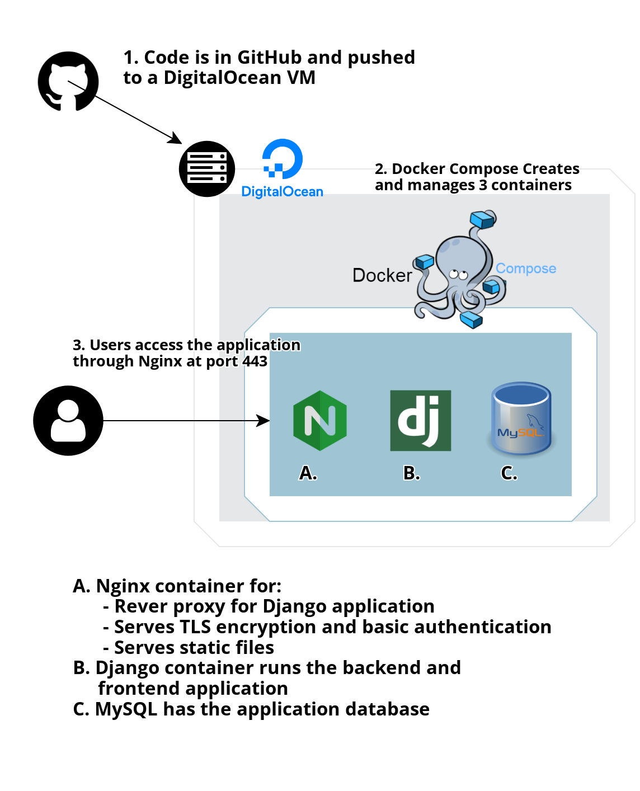

# Django Application for Vulnerability Management
Containerized application to manage vulnerabilities found in hosts. It runs on Docker Compose, creating containers for Nginx, Django, and MySQL. 

#### Software used on this project

1. [Docker and  Docker Compose](https://www.docker.com/): Defining and running the multi-container application
2. [Django](https://www.djangoproject.com/): Python web development
3. [MySQL](https://www.mysql.com/): Relational database management system
4. [Nginx](https://www.nginx.com/): Web server, reverse proxy, TLS encryption and basic authentication
5. [Boostrap](https://getbootstrap.com/): Frontend toolkit
6. [Booswatch](https://bootswatch.com/): Themes for Boostrap
7. [Wait-for-it.sh](https://github.com/vishnubob/wait-for-it): Script to wait for the availability of a port
8. [Bash](https://www.gnu.org/software/bash/): To script testing and deployment
8. [DigitalOcean](https://www.digitalocean.com/): For hosting virtual machine
8. [Charts.js](https://www.chartjs.org/): JavaScript charting library

## How to run
- Make sure you have Bash, Docker and Docker Compose installed.
- Quick deployment command `scripts/deploy.sh`.
- For online server is `django-vulns/scripts/deploy.sh -prod`.

#### Online Demo:
- Link: https://db.nubitlan.com
- Username: `username`
- Password: `1Django!`

## I'm aware of passwords and secrets in the repo, this is for demo only

### EER Diagram

### Infra Diagram

