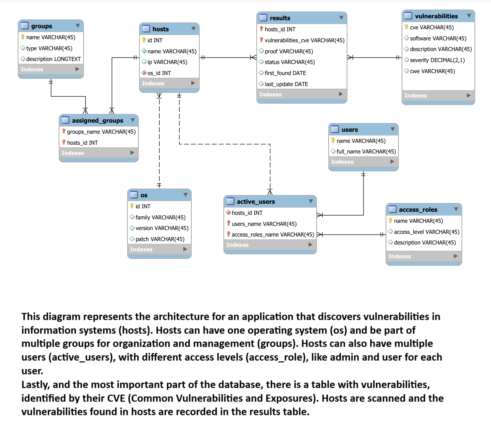

# Django Application for Vulnerability Management
Quick deployment command `scripts/deploy.sh`. For online server is `django-vulns/scripts/deploy.sh -prod`.
Steps:

1. Build DB in db_files and use docker compose up (see README.md there)
2. If the application is hosted online, change to debug false in project settings
3. Use username: `username` and password: `1Django!` to connect to https://db.nubitlan.com

## I'm aware of passwords and secrets in the repo, this is for demo only

### EER Diagram

